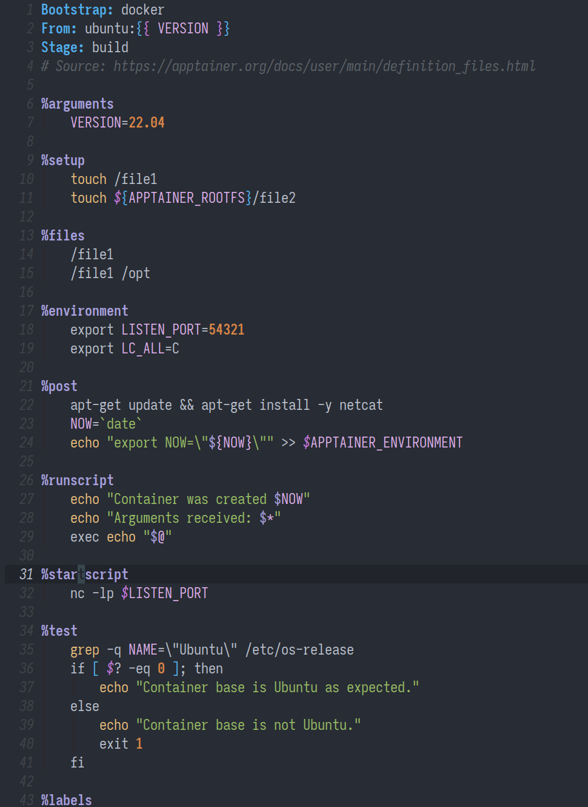

# apptainer-mode

A simple major mode for [Apptainer definition files](https://apptainer.org/docs/user/main/definition_files.html).

Derived from `sh-mode`, `apptainer-mode` implements basic font-locking for definition (`.def`) file headers and section labels.

 

  

