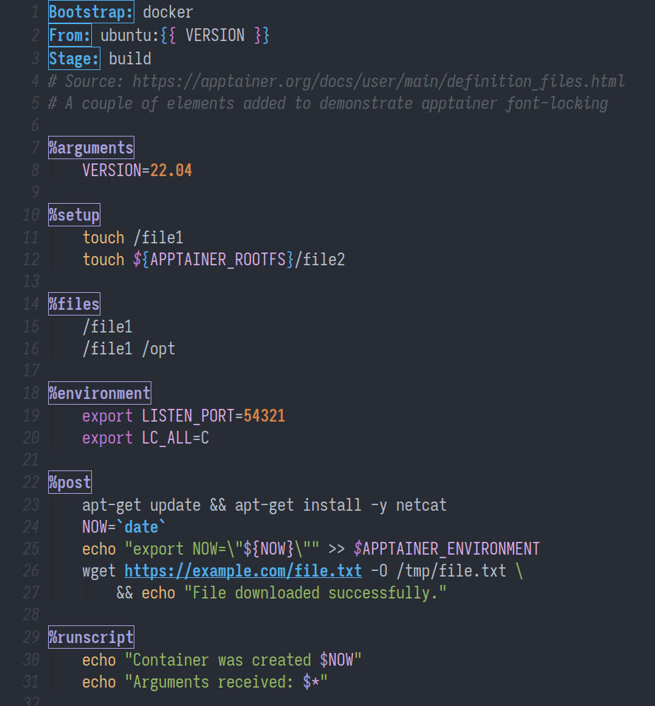
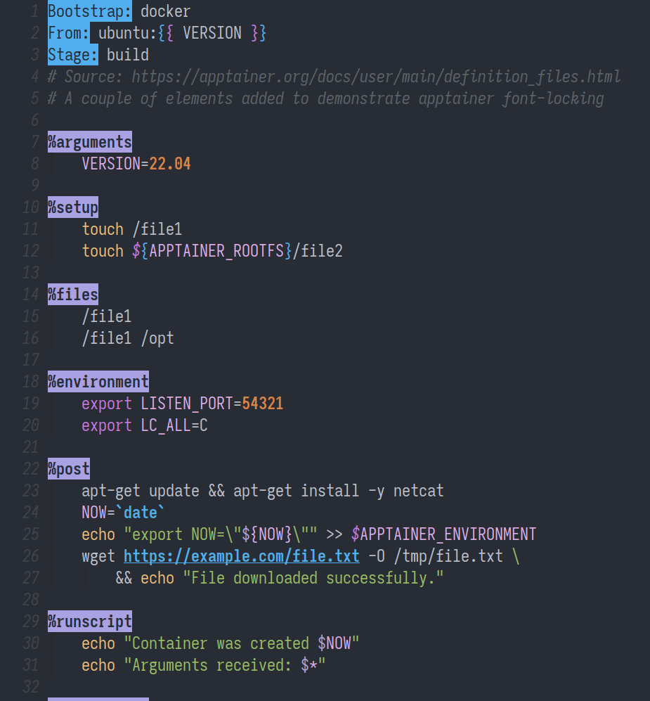

# apptainer-mode


A simple major mode for [Apptainer definition files](https://apptainer.org/docs/user/main/definition_files.html).

Derived from `sh-mode`, `apptainer-mode` implements basic font-locking for definition (`.def`) file headers and section labels.

<br />
<p align="center">
  
</p>


## Installation

To download the **release** version, download it from the Releases section and unpack the archive.

To download the **development** version, run the following snippet, filling in the desired destination path:

``` bash
git clone git@github.com:jrgant/apptainer-mode </path/to/destination>
```

In either case, add `apptainer-mode` using one of the following:

``` emacs-lisp
(load-file "/path/to/apptainer-mode.el")

;; OR, if you use `use-package`
(use-package
  :load-path "/path/to/apptainer-mode/")
```


## Options

The user can set a handful of variables to tweak font-locking in `.def` files. These variables consist primarily of flags that allow users to bold, italicize, box, or fill Apptainer header keywords and section headers easily. 

All of the variables listed below default to `nil`.

|                                 |                                                       |
|:--------------------------------|:------------------------------------------------------|
| `apptainer-bold-headers`        | Non-nil bolds header keywords                         |
| `apptainer-italic-headers`      | Non-nil italicizes header keywords                    |
| `apptainer-boxed-headers`       | Non-nil draws a box around header keywords            |
| `apptainer-filled-headers`      | Non-nil sets a background fill on header keywords     |
| `apptainer-bold-sections`       | Non-nil bolds section headers                         |
| `apptainer-italic-sections`     | Non-nil italicizes section headers                    |
| `apptainer-boxed-sections`      | Non-nil draws a box around section headers            |
| `apptainer-filled-sections`     | Non-nil sets a background fill on section headers     |
| `apptainer-boxed-links`         | Non-nil draws a box around URLs and email addresses   |
| `apptainer-italicize-retriever` | Non-nil italicizes `$` environment variable retriever |

If you use the `load-file` method above, set these variables before loading the package. If you use `use-package`, set the variables in the `:init` section.

``` emacs-lisp
(setq apptainer-boxed-headers t
      apptainer-boxed-sections t)
```


| Boxed Faces                           | Filled Faces                           |
|:-------------------------------------:|:--------------------------------------:|
|  |  |

To further customize fonts, use `set-face-attribute`.

``` emacs-lisp
(set-face-attribute 'apptainer-section-face nil :underline t :foreground "red")
```


